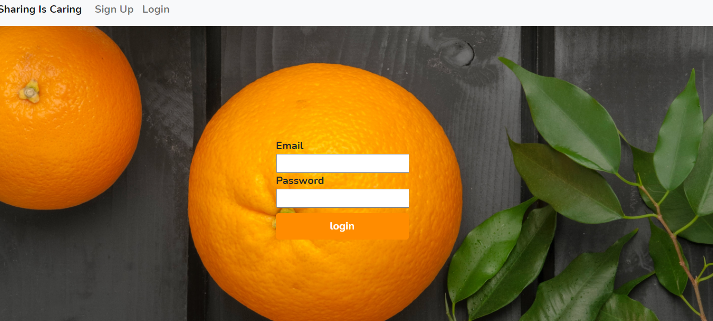

# Sharing is Caring 

## Table of Contents:

- [Description](#description)
- [Installation](#installation)
- [Usage](#usage)
- [License](#license)
- [How to Contribute](#how-to-contribute)
- [Contact](#contact)

## Description:

An interactive food blog for the culinary curious!

This is a Full- Stack Application which allows the users to add recipes based on their own culinary tradition, they can also comment on & vote for their favourite recipes.

This is a collaborative project completed by students who are new to coding and learning how to become full-stack developers. We are following the MVC (Model, Views, Controllers) file structure and using MySQL & Handlebars to create our database and HTML templates, bycrypt to ensure sensitive information like passwords are encrypted and Sequelize to help us to manage our SQL database.

## Installation:

## To run this application on your local device:

1. Clone the repository (repo) `./sharing_is_caring` from GitHub to your local device by typing `git clone` in your terminal or bash followed by the `ssh key` for this repo.

2. To run the application on a local server use the following commands from the terminal or bash:

   - `npm init` to initialise npm and download your package.json file;
   - `npm i` install package-lock.json;

3. See the `dependencies` section of the `package.json` file for this application to identify the any other dependencies & the scripts that are used and will be required to run this application.

4. Please ensure that MySQL is installed and set up on your device before using this application. A guide can be found [here](https://dev.mysql.com/doc/mysql-installation-excerpt/5.7/en/)

5. Initialise the database by running the following commands in the terminal:

   - `mysql -u root -p`
   - `source db/schema.sql`
   - `source db/seeds.sql`
   - `npm run seed`

6. In the `.env.EXAMPLE` file:

   - add the name of the database (which in this case is `sharing_db`),
   - update the password to give you access to mySQL (on line 2) to your own MySQL password. For example: `password: 'Password123'`
   - add the database user (which in this case is `root`)
   - remove the file extension `.EXAMPLE` so you are left with the file extension `.env`.

7. To access your server run the following command in your Terminal or Git `node server.js`.

   - You should see a message that tells you which port your server is operating from e.g. `server listening on port: 3000`

   ## Screen Shots: 
   
   

   ## Heroku Link: https://sharing-is-caring-dreamteam.herokuapp.com/login

   ## License:

   This project is covered under the MIT License: 

   ## How to Contribute

   Either fork the repository `Sharing is Caring` or contact `The Dream Team` using the details shown below:

   ## Email:

   - Mustafa Ali:mustafa_a_ali@outlook.com
   - Paul Aston:p_aston@hotmail.co.uk
   - Jacqie Williamson: jacqieq@me.com

   ## Git Hub:

   - [mus-ali1](https://github.com/mus-ali1),
   - [odders17](https://github.com/odders17),
   - [jacqieq6464](https://github.com/jacqieq6464).
